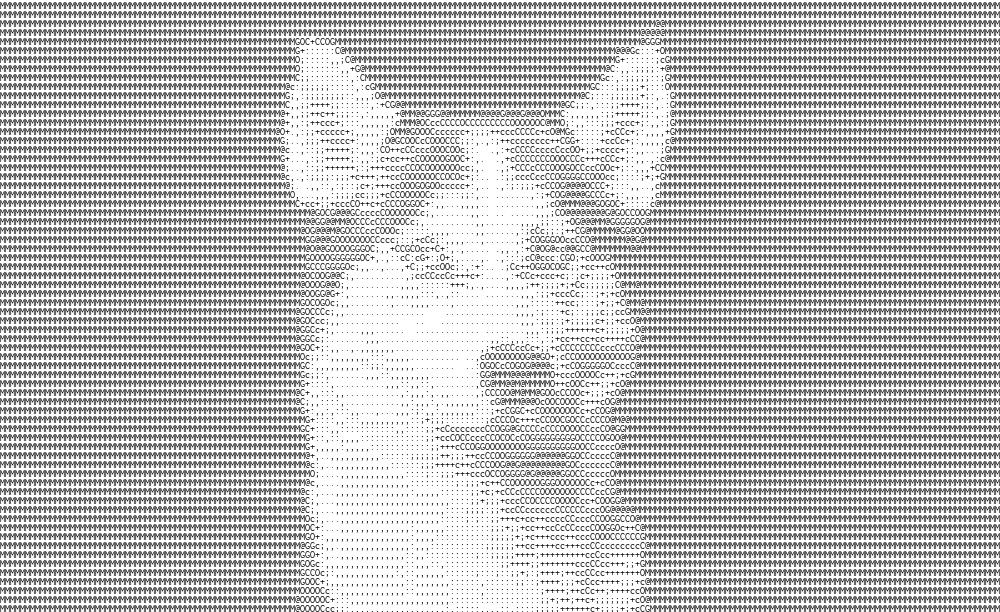

# Ascii-Imager
Recreate an image using Ascii characters.

The main image to ascii conversion code can be done in less than 15 lines of code using python/opencv. You can find the code in `image_to_ascii_mini.py`.

A JS implementation of the code can be found online [here](https://batman-nair.github.io/ASCII-Imager/).

## Sample Outputs

<p align="center">
	
	
	
	
</p>

## Usage
The tool is made using Python, OpenCV2. Generating image output is done using PIL.

```
usage: main.py [-h] -i INPUT [-o OUTPUT] [-s SIZE] [-inv] [-html] [-img]

Convert images to ascii

optional arguments:
  -h, --help            show this help message and exit
  -i INPUT, --input INPUT
                        Input file name
  -o OUTPUT, --output OUTPUT
                        Output file base name. Extension not needed
  -s SIZE, --size SIZE  Size as number of rows and cols of characters. (Sample values [Cols]x[Rows]:
                        '200x' '300x100')
  -inv, --invert        Invert the dark and light shades
  -html, --html         Generate HTML output
  -img, --image         Generate image output

```

Sample Usage example:
`python main.py -i samples/leo.jpg`

`python main.py -i samples/dog.jpg -s '100x' -o dog_ascii -img`


## Contributing

If you are intersted in contributing there are a lot more things that can be done like
1. GIF to Ascii GIF
2. Video to Ascii Video
3. Different language implementations


If you like the project, leave a star. :)
